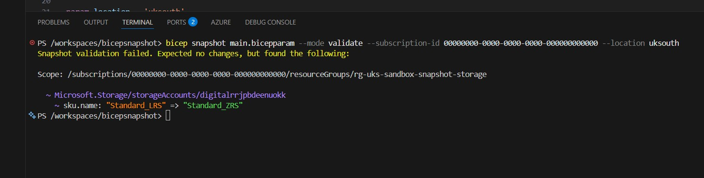
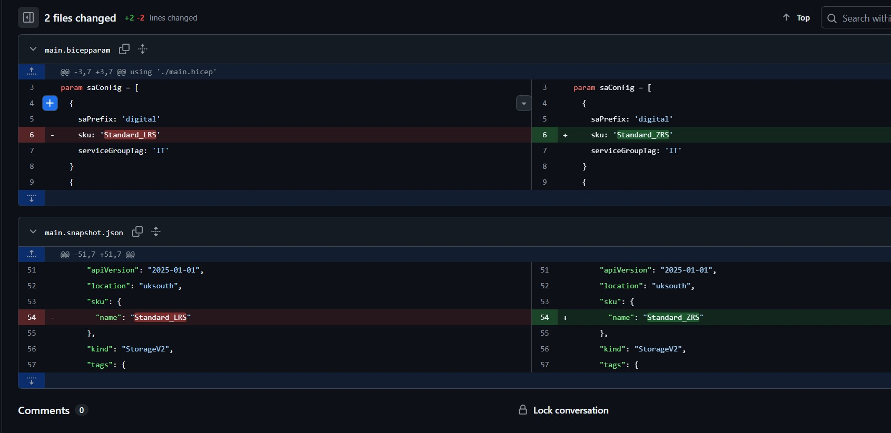
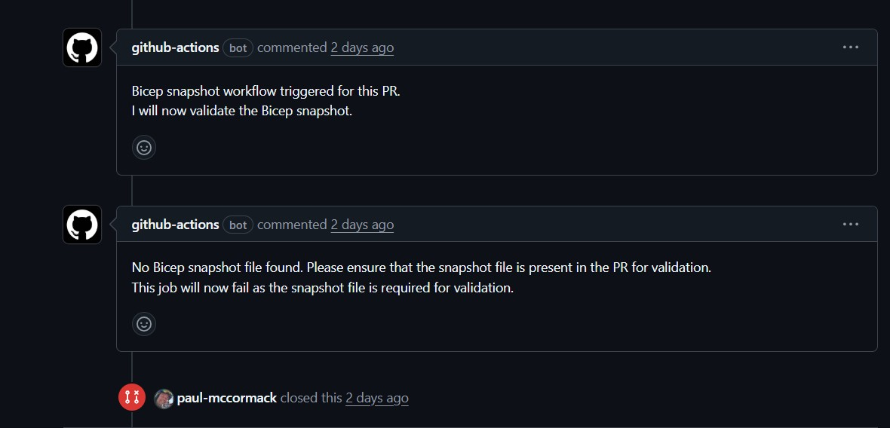
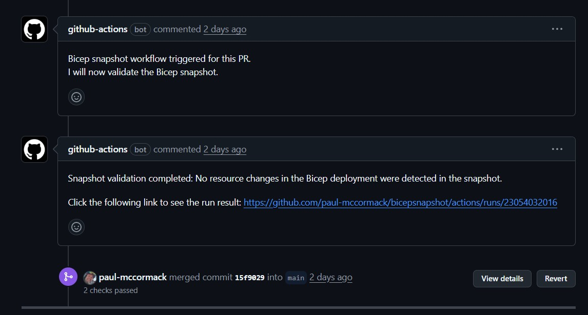
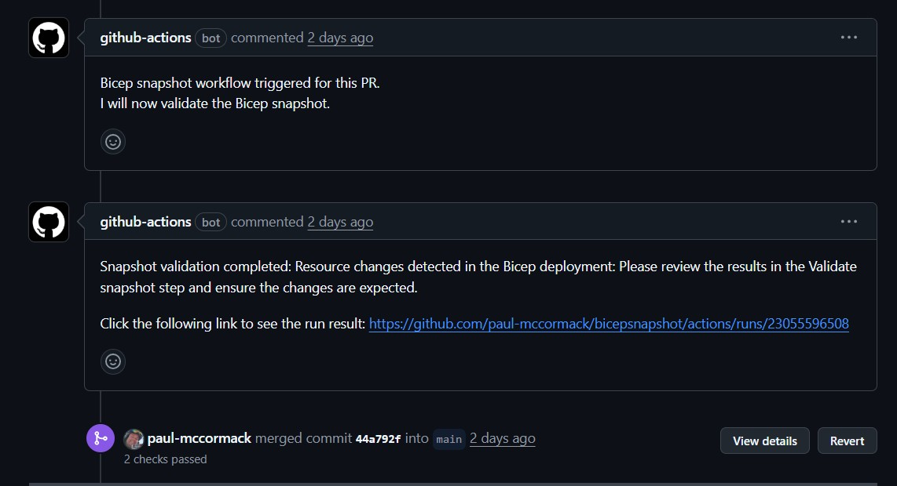
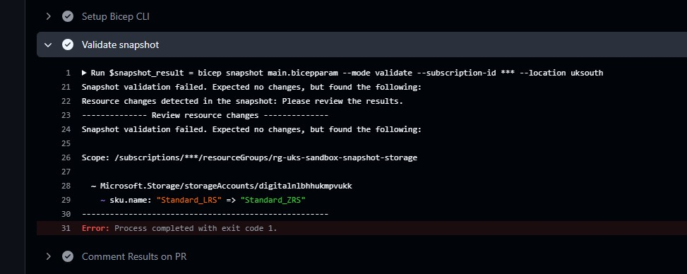
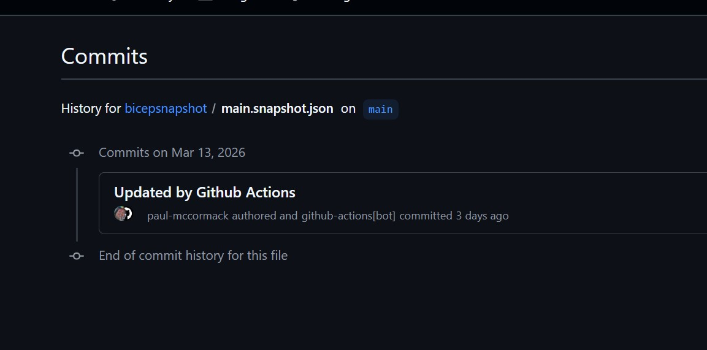

## Introduction

> [!TIP]+ Companion GitHub Repository
> The code detailed in this post can be found in this [repository](https://github.com/paul-mccormack/bicepsnapshot)
{icon="github"}

With release v0.41.2 a new command was made generally available: `bicep snapshot`, which generates a JSON file containing a normalized view of the resources declared in a Bicep deployment. You can read about the command in the [Bicep release notes](https://github.com/Azure/bicep/releases/tag/v0.41.2).<br><br>
The aim of this command is to give Bicep users an easier way to validate any changes that have been made to a Bicep deployment without needing to crawl through potentially large templates using nested modules.<br><br>
The workflow for this feature would go something like this:

1. Create a Bicep template and parameter file to deploy some resources to Azure.
2. Create a snapshot file using the `bicep snapshot` command in overwrite mode.
3. Make some changes to the Bicep template or parameter file.
4. Run the `bicep snapshot` command again in validate mode to compare the changes with the previously saved snapshot.

The output when run in a terminal is very similar to the output from a `what-if` but trimmed down to just the resources or properties that have changed. Making it much easier to quickly validate only the desired changes will happen before deployment.

Running the command manually in a terminal is shown below:

To create a snapshot:
```PowerShell
bicep snapshot main.bicepparam --mode overwrite --subscription-id 00000000-0000-0000-0000-000000000000 --location uksouth
```
You don't strictly need to include the `--subscription-id` and `--location` parameters as the command will put placeholders in the snapshot. However, if you want a more accurate result it's worth including them.

To validate against an existing snapshot:
```PowerShell
bicep snapshot main.bicepparam --mode validate --subscription-id 00000000-0000-0000-0000-000000000000 --location uksouth
```

The screenshot below shows the output for changing a storage account SKU. If you've ever run a `what-if` on a Bicep template this will look very familiar, However, as you can see it's much easier to validate the changes as it's much more concise and focused.



## Using snapshots with version control

The snapshot file is a JSON file which can be included in version control and used to track changes to your Bicep deployments. With the snapshot file checked in and tracked you can quickly check the history of one single file in the repository to track changes that have been made to the resources over time.<br><br>
The screenshot below shows an example of a snapshot file history:



This is a completely workable method but as you are looking at the raw json file it isn't as clean as looking at the console output from `bicep snapshot`.

## Automating the process with GitHub Actions

So far so good but I wanted to see if I could integrate it into a CI/CD pipeline, providing a method of automated validation using pull requests to detect if changes have occurred and inform a reviewer before deployment.<br><br>
The result ended up being two GitHub Actions workflows:

**Snapshot Workflow** - This workflow is triggered on a pull request to the main branch and performs the following steps:
1. Checks for the existance of a snapshot file in the incoming pull request. If it doesn't find one the run is aborted and a comment is created on the pull request asking the contributor to include one.
2. If a snapshot file is present the workflow runs `bicep snapshot` in validate mode checking if the deployment state matches the snapshot file. If changes are found a comment is created stating the reviewer should check the run logs for more details. If no changes are detected a comment is created telling the reviewer that snapshot validation passed. Providing a quick and easy way to increase confidence that merging the pull request won't cause any unexpected changes to the Bicep deployment.

**Deploy Workflow** - This workflow is triggered on a push to the main branch and performs the following steps:
1. The Bicep deployment is executed.
2. The snapshot file is updated by running `bicep snapshot` in overwrite mode and committed back to the repository. Ensuring the snapshot file is automatically kept up to date.

In the next section I'll take a look at both of the workflow. I'm going to focus on the jobs and steps that are specific for what I am trying to accomplish.  Things like triggers and permissions for the `GITHUB_TOKEN` are included in the workflow files in the companion repository if you want to see the full code. The link is at the top.

## Snapshot workflow

As this feature is aimed at tracking changes to a Bicep deployment I have made the assumption the resources have already been deployed and an up to date snapshot file exists containing the state of the deployment.<br><br>
I now need to ensure that any PR includes that snapshot file. If it doesn't exist the later stages of the workflow are going to fail so the best course of action would be to fail it as quickly as possible.  The workflow code below shows how I did this with a simple PowerShell `Test-Path` check and load the result into the `GITHUB_OUTPUT` environment variable to be used by the subsequent comment step and job failure step.  These two steps will only run if the snapshot file is missing.

```yaml
- name: Check for Bicep Snapshot
  id: check-snapshot
  shell: pwsh
  run: |
    if (Test-Path -Path "*.snapshot.json") {
        Write-Host "Bicep snapshot file found."
        echo "snapshot_exists=true" | Out-File -FilePath $env:GITHUB_OUTPUT -Append
    } else {
        Write-Host "No Bicep snapshot file found. Please ensure that the snapshot file is present in the PR for validation."
        echo "snapshot_exists=false" | Out-File -FilePath $env:GITHUB_OUTPUT -Append
    }

- name: Comment no snapshot found
  if: steps.check-snapshot.outputs.snapshot_exists == 'false'
  uses: actions/github-script@v8
  with:
    script: |
      const marker = "<!-- bicep-snapshot-exists-result -->";
      const body = `${marker}
      No Bicep snapshot file found. Please ensure that the snapshot file is present in the PR for validation.
      This job will now fail as the snapshot file is required for validation.`;
      await github.rest.issues.createComment({
        owner: context.repo.owner,
        repo: context.repo.repo,
        issue_number: context.payload.pull_request.number,
        body
      });

- name: fail job if no snapshot found
  if: steps.check-snapshot.outputs.snapshot_exists == 'false'
  shell: pwsh
  run: |
    Write-Host "Failing the job as no snapshot file was found for validation."
    exit 1
```
Testing this we get GitHub Actions posting a comment giving the contributor a clear message about the requirement to include a snapshot.



The rest of this workflow is focused on running the `bicep snapshot` command and reporting the results in the PR comments.

```yaml
- name: Validate snapshot
  id: validate-snapshot
  continue-on-error: true
  shell: pwsh
  run: |
    $snapshot_result = bicep snapshot ${{ env.BICEP_PARAMETERS }} --mode validate --subscription-id ${{ secrets.AZURE_SUBSCRIPTION_ID }} --location ${{ env.LOCATION }}

    if ($snapshot_result -eq $null) {
        Write-Host "No resource changes detected in the snapshot."
        $snapshot_result = "No resource changes in the Bicep deployment were detected in the snapshot."
    } else {
        Write-Host "Resource changes detected in the snapshot: Please review the results."
        $snapshot_result = "Resource changes detected in the Bicep deployment: Please review the results in the Validate snapshot step and ensure the changes are expected."

        Write-Host "-------------- Review resource changes --------------"
        bicep snapshot ${{ env.BICEP_PARAMETERS }} --mode validate --subscription-id ${{ secrets.AZURE_SUBSCRIPTION_ID }} --location ${{ env.LOCATION }}
        Write-Host "-----------------------------------------------------"
    }
    "snap_shot_result=$snapshot_result" | Out-File -FilePath $env:GITHUB_OUTPUT -Append

- name: Comment Results on PR
  uses: actions/github-script@v8
  with:
    script: |
      const marker = "<!-- bicep-snapshot-result -->";
      const body = `${marker}
      Snapshot validation completed: ${{ steps.validate-snapshot.outputs.snap_shot_result }}
            
      Click the following link to see the run result: ${{ github.server_url }}/${{ github.repository }}/actions/runs/${{ github.run_id }}`;
            
      await github.rest.issues.createComment({
        owner: context.repo.owner,
        repo: context.repo.repo,
        issue_number: context.payload.pull_request.number,
        body
      });
```
Testing both outcomes of this part of the workflow is shown in the next two screenshots.

No changes detected:


Changes detected:


In both cases I've included a link to the workflow run log so the reviewer has an easy click through option to see the detailed output. This is especially important for the changes detected outcome.

The following screenshot shows the run logs for a simple change to a storage account SKU. Super easy to see what is changing!



The eagle eyed reader will have noticed that this step exited in an error state. That is due to how the `bicep snapshot` command works. When a change is detected it exits with a non-zero exit code. To accomodate this behaviour this step needs `continue-on-error: true` set to ensure the workflow continues to the next step.

You also might have noticed I have set the bicep files to be parameters in the workflow. This is to make the workflow reusable and not tied to a specific file name. The snapshot detection logic is also using `*.snapshot.json` to ensure it picks up any snapshot file regardless of the name.

## Deploy workflow

Now onto the deploy workflow. Like the previous workflow this has two main jobs, perform the deployment then update the snapshot file.<br><br>
The deployment job is fairly standard so I'm not going to dwell on that, There are a lot of ways to perform a Bicep deployment in a GitHub Actions workflow. You could easily substitute this job for whichever method you are comfortable with.<br><br>
The snapshot update job is more interesting, and surpisingly simple. The workflow code is shown below:

```yaml
update-snapshot:
  name: Update Bicep snapshot
  runs-on: ubuntu-latest
  needs: deploy
  steps:
    - name: Checkout repository
      uses: actions/checkout@v6

    - name: Setup Bicep CLI
      uses: anthony-c-martin/setup-bicep@v0.3

    - name: Update snapshot
      shell: pwsh
      run: |
        bicep snapshot ${{ env.BICEP_PARAMETERS }} --mode overwrite --subscription-id ${{ secrets.AZURE_SUBSCRIPTION_ID }} --location ${{ env.LOCATION }}

    - name: Git Auto Commit
      uses: stefanzweifel/git-auto-commit-action@v7.1.0
      with:
        commit_message: Updated by Github Actions
```

The key part of this workflow is `Update snapshot`. This ensures that after every deployment the snapshot file is updated to reflect the current state of the deployment without requiring manual intervention. Sounds like a win to me! 😀<br><br>
The final step is super simple thanks to the [Git Auto Commit Action](https://github.com/marketplace/actions/git-auto-commit). This will commit and push any changes back to the repo.<br><br>
Checking the git history on the snapshot file I can see after a PR has been merged GitHub Actions has commited an updat to the file.



## Conclusion

On the whole I think `bicep snapshot` is a pretty cool feature. Contributors can use it locally in the terminal to quickly validate changes before performing a deployment and as I've shown you can integrate it into a automated workflow without too much fuss.<br>
One thing I haven't addressed is how to deal with branch protection policies. If the main branch is protected the final direct commit for the updated snapshot file is going to fail. One possible solution for that might be to use a personal access token with admin rights.<br>
That's on my to-do list to test out and if it works I'll update this post with the details.<br><br>
If you've made it this far thanks for reading! I hope you found this useful. If you have any suggestions for improvements please reach out to me on LinkedIn or open an issue in the GitHub repository. The link is at the top of the post. Cheers! 🍻
