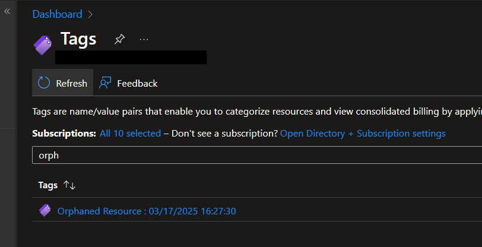
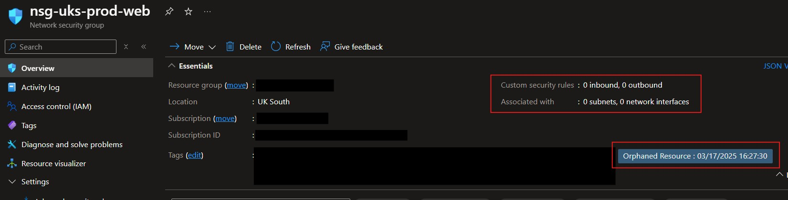

## Introduction

Resources in Azure can be left behind as other resources reach the end of their life and are deleted.  Some don't incur cost like Network Security Groups or NIC's. Other resources which are way too easy to be left behind do, for example Public IP addresses and VM disks.  In the case of VM disks that wasted cost could be considerable.

Advisor does alert you to orphaned disks but I wanted a method to catch the rest of the resources I've just mentioned.  My solution is to use an Automation Account to run Azure Resource Graph queries then tag the suspected orphaned resources for investigation.  Searching for the tag in the portal will list them with the date they were tagged in the value.

More resources could easily be added to the search criteria just by adding the necessary code to the PowerShell script in the runbook.

The deployment will be targetted at the top level management group using Bicep in a Deployment Stack, this allows us to take advantage of the role assignments being cleaned up automatically if the stack is deleted.  The resources can be deployed where ever in your environment is convenient by editing the deployment parameters.

> [!TIP]+ Companion GitHub Repository
> The code detailed in this post can be found in this [repository](https://github.com/paul-mccormack/AzureAutomationResourceCleanUp)
{icon="github"}

## Deployment details

The deployment is very simple.  Consisting of an Automation Account, wtih the necessary AZ PowerShell modules and associated schedule to run a job daily at 9:30am.  The system assigned identity is then given two role assignments at the top level management group.  These are Reader and Tag Contributor.

## Required PowerShell modules

A quick note on the PS modules.  Az.ResourceGraph is not automatically available in an Azure Automation Account.  It will need to be installed.  Additionally you will need to update Az.Accounts to version 4.0.2 for it to support Az.ResourceGraph.  You could do these steps manually but you can also install and upgrade modules using bicep.  An update and an install use the same bicep resource declaration so it was easy to create a `for` loop to do this.  The parameters are simply the name of the module and the PowerShell Gallery API URI for the automation account to get the modules.

As the deployment is scoped to a management group the resources are deployed using a module scoped to the target resource group.  See [main.bicep](https://github.com/paul-mccormack/AzureAutomationResourceCleanUp/blob/main/main.bicep) for the Bicep Template being used.

To deploy the template use the following command:

```ps
New-AzManagementGroupDeploymentStack -Name deploymentName -ManagementGroupId yourMgName -Location yourLocation -TemplateFile .\main.bicep -TemplateParameterFile .\main.bicepparam -ActionOnUnmanage deleteResources -DenySettingsMode None
```

## Runbook PowerShell Script

The PowerShell script, which can be found here, [tagOrphanedResources.ps1](https://github.com/paul-mccormack/AzureAutomationResourceCleanUp/blob/main/tagOrphanResources.ps1), is also very simple.

1. Set the tag key to use.
2. Get the current date and time for the tag value.
3. Setup the resource graph queries.
4. Find all the subscriptions contained under your target Management Group and any child Management Groups.
5. Run the resourse graph queries in each subscription then loop through the results setting the tag on any resources identified.

I considered putting the loop into a function to prevent code repetition but decided against it for the sake of keeping the run book logs clear,  particularly when it doesn't find any type of resource I am looking for.  I want it to say "No NSG's were found" and "No disks were found" instead of repeating "No resources were found".  Maybe I'll revisit that at some point.

Setting up the resource graph queries to find orphaned resources involved creating a resource of that type then comparing the properties to the same type of resource which was in use.

For example.  The NSG query looks looks like the KQL below

```kql
$orphanedNsgQuery = 'Resources
| where type == "microsoft.network/networksecuritygroups"
| where isnull(properties.networkInterfaces)
| where isnull(properties.subnets)
| where tags !contains "Orphaned Resource"
| project id, name'
```

An NSG can be attached to a Subnet or a NIC.  If not attached to anything the properties doesn't contain `properties.networkInterfaces` or `properties.subnets`.  To prevent already identified resources being found again on the next run and the date value of the tag being overwritten I have included a check to filter out already tagged resource with the line `| where tags !contains "Orphaned Resource"`.

## Checking it works

After deploying the solution and giving it a test run I can go to Tags in the portal and search for the tag key.



Then digging into the resources with that tag it's found an NSG that is not attached to any subnets or NIC resource.  Most likely a candidate for deletion.



All we need to do now is setup a process for checking periodically for that tag key then investigating any resources identified.  Should be an easy way to keep things nice and clean and drive up the cost efficiency of our Azure environment.

## Final note

If you want to deploy this please ensure you fork the repository and change `param scriptUri` in `main.bicepparam` to point to your own copy of the PowerShell script.  If I change my copy or remove it your deployments will fail.