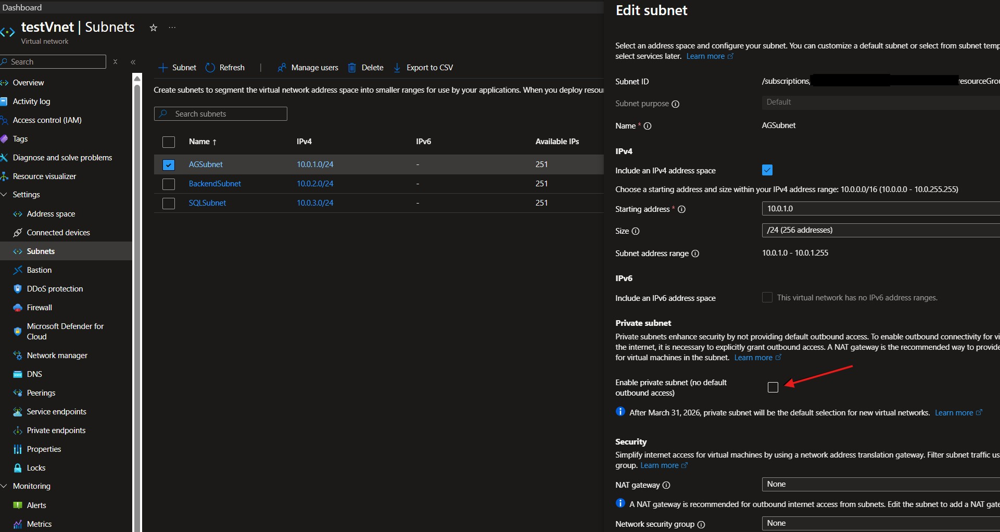
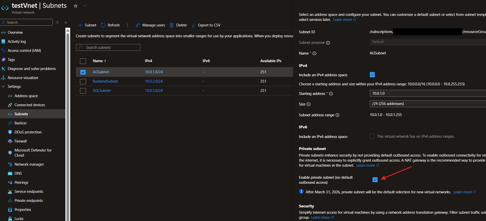

## Introduction

Bicep version 0.38.3 was released at the start of October 2025, the headline new feature in this release was the new `onlyIfNotExists()` decorator.<br><br>
This decorator enables you to inform ARM that if the named resource already exists at the current scope then skip it on incremental deployments of a Bicep template.<br><br>
This is a great addition to Bicep's capabilities enabling those "deploy it then don't touch it" scenarios with far more ease than we have had before. A big plus for the idempotency aspect of practicing Infrastructure as code using Bicep! Let's have a look at how to use it, things to be aware of and find some situations where it might be useful.

## Usage

The `onlyIfNotExists()` decorator can be applied to any resource in a Bicep template, like other decorators you place it before the resource declaration:

```bicep
@description('This resource will only be deployed if it does not already exist at the current scope')
@onlyIfNotExists()
resource myResource 'Microsoft.Example/resourceType@2025-01-01' = {
  name: 'myResourceName'
  location: resourceGroup().location
  properties: {
    // Resource properties here
  }
}
```
It's worth noting the decorator is only looking for the existence of a resource with the same name and type at the current scope, it does not consider any other properties of the resource.<br><br>
This means if you needed to update any properties on an incremental deployment you would need to remove the decorator to enable the update to occur.

Another thing to be aware of is the decorator is not supported on module declarations. So if you are all in on Azure Verified Modules this isn't going to do anything for you.

## Testing the functionality

Now a quick example of the decorator in action. I'll deploy a vnet and some subnets, have a look at some what-if results on the initial deployment and an incremental deployment then have a little mess around with updating the resources. The results are quite interesting.

The Bicep template below deploys a vnet and iterates through an array of three subnets, the `onlyIfNotExists()` decorator is applied to the subnet resource declaration:

```bicep
// Type Definitions

@description('Subnet Configuration')
type subnetConfigType = {
  @description('Required: Subnet name')
  name: string

  @description('Required: Subnet IP prefix in CIDR format')
  subnetAddressPrefix: string
}

// Parameters

@description('Location for resources from the resource group location.')
param location string = resourceGroup().location

@description('Required: Vnet name.')
param vnetName string = 'testVnet'

@description('Required: VNet IP prefix in CIDR format.')
param vnetIpPrefix string = '10.0.0.0/16'

@description('Required: Subnet configurations.')
param subnetConfigs subnetConfigType[] = [
  {
    name: 'AGSubnet'
    subnetAddressPrefix: '10.0.1.0/24'
  }
  {
    name: 'BackendSubnet'
    subnetAddressPrefix: '10.0.2.0/24'
  }
  {
    name: 'SQLSubnet'
    subnetAddressPrefix: '10.0.3.0/24'
  }
]

// Resources

@description('Deploy Vnet')
resource vnet 'Microsoft.Network/virtualNetworks@2024-05-01' = {
  name: vnetName
  location: location
  properties: {
    addressSpace: {
      addressPrefixes: [
        vnetIpPrefix
      ]
    }
    privateEndpointVNetPolicies: 'Disabled'
  }
}

@description('Deploy subnets')
@batchSize(1)
@onlyIfNotExists()
resource subnets 'Microsoft.Network/virtualNetworks/subnets@2024-05-01' = [ for (subnetConfig, index) in subnetConfigs: {
  name: subnetConfig.name
  parent: vnet
  properties: {
    addressPrefix: subnetConfig.subnetAddressPrefix
  }
}]
```
Running a what-if in a empty resource groups shows all the resources will be created.  I've trimmed the results to keep this a bit more manageable:

```powershell
Resource and property changes are indicated with this symbol:
  + Create

The deployment will update the following scope:

Scope: /subscriptions/---/resourceGroups/rg-uks-sandbox-pmc

  + Microsoft.Network/virtualNetworks/testVnet [2025-05-01]

      apiVersion:                             "2025-05-01"
      id:                                     "/subscriptions/Microsoft.Network/virtualNetworks/testVnet"       
      location:                               "uksouth"
      name:                                   "testVnet"
      properties.addressSpace.addressPrefixes: [
        0: "10.0.0.0/16"
      ]
      properties.privateEndpointVNetPolicies: "Disabled"
      properties.subnets: [
        0:

          name:                     "AGSubnet"
          properties.addressPrefix: "10.0.1.0/24"

        1:

          name:                     "BackendSubnet"
          properties.addressPrefix: "10.0.2.0/24"

        2:

          name:                     "SQLSubnet"
          properties.addressPrefix: "10.0.3.0/24"

      ]
      type:                                   "Microsoft.Network/virtualNetworks"

  + Microsoft.Network/virtualNetworks/testVnet/subnets/AGSubnet [2025-05-01]

      apiVersion:               "2025-05-01"
      id:                       "/subscriptions/Microsoft.Network/virtualNetworks/testVnet/subnets/AGSubnet"    
      name:                     "AGSubnet"
      properties.addressPrefix: "10.0.1.0/24"
      type:                     "Microsoft.Network/virtualNetworks/subnets"

  + Microsoft.Network/virtualNetworks/testVnet/subnets/BackendSubnet [2025-05-01]

      apiVersion:               "2025-05-01"
      id:                       "/subscriptions/Microsoft.Network/virtualNetworks/testVnet/subnets/BackendSubnet"
      name:                     "BackendSubnet"
      properties.addressPrefix: "10.0.2.0/24"
      type:                     "Microsoft.Network/virtualNetworks/subnets"

  + Microsoft.Network/virtualNetworks/testVnet/subnets/SQLSubnet [2025-05-01]

      apiVersion:               "2025-05-01"
      id:                       "/subscriptions/Microsoft.Network/virtualNetworks/testVnet/subnets/SQLSubnet"   
      name:                     "SQLSubnet"
      properties.addressPrefix: "10.0.3.0/24"
      type:                     "Microsoft.Network/virtualNetworks/subnets"

Resource changes: 4 to create.
```

Now I'll deploy the template. Modify the vnet resource then run a what-if to test an incremental run.<br><br>

The second what-if shows a very different result.

```powershell
Resource and property changes are indicated with these symbols:
  ~ Modify
  x NoEffect
  * Ignore

The deployment will update the following scope:

Scope: /subscriptions/8a9d9b4d-56c8-4fe7-b760-6b84698a3353/resourceGroups/rg-uks-sandbox-pmc

  ~ Microsoft.Network/virtualNetworks/testVnet [2025-05-01]
    ~ properties.privateEndpointVNetPolicies: "Disabled" => "Basic"   // <----The modified proprty
    x properties.subnets[0].type:             "Microsoft.Network/virtualNetworks/subnets"
    x properties.subnets[1].type:             "Microsoft.Network/virtualNetworks/subnets"
    x properties.subnets[2].type:             "Microsoft.Network/virtualNetworks/subnets"

  * Microsoft.Network/virtualNetworks/testVnet/subnets/AGSubnet [2025-05-01]
  * Microsoft.Network/virtualNetworks/testVnet/subnets/BackendSubnet [2025-05-01]
  * Microsoft.Network/virtualNetworks/testVnet/subnets/SQLSubnet [2025-05-01]

Resource changes: 1 to modify, 3 to ignore.
```

Perfect, exactly what I want! The vnet is being modified as it already exists and the decorator is not applied to it, the subnets are being ignored as they already exist and the decorator is applied to them.

Now let's see what happens if I modify the properties of the subnets and run a what-if with the decorator still in place.  I've added a new property `defaultOutboundAccess: 'false` to the subnet resource declaration:

```bicep
@description('Deploy subnets')
@batchSize(1)
@onlyIfNotExists()
resource subnets 'Microsoft.Network/virtualNetworks/subnets@2025-05-01' = [ for (subnetConfig, index) in subnetConfigs: {
  name: subnetConfig.name
  parent: vnet
  properties: {
    addressPrefix: subnetConfig.subnetAddressPrefix
    defaultOutboundAccess: false  // <--------- New property
  }
}]
```
Ok.  The what-if results for this are now really confusing!<br><br>
The subnets are still being ignored due to the presence of the decorator, but the results are showing the new property being added to the subnets in the vnet resource.<br> This is misleading, it looks like the subnets are going to be updated with the new property but in reality they will be ignored and no changes will be made to them. I'm putting this down to the "noise" what-if results sometimes present.<br><br>
The Bicep team are working hard on improving what-if to reduce these inaccuracies but for now it's important to understand that what-if is not perfect and we need to be careful when interpreting the results. I guess that's why we have test environments! 😉

```powershell
Resource and property changes are indicated with these symbols:
  + Create
  ~ Modify
  x NoEffect
  * Ignore

The deployment will update the following scope:

Scope: /subscriptions/8a9d9b4d-56c8-4fe7-b760-6b84698a3353/resourceGroups/rg-uks-sandbox-pmc

  ~ Microsoft.Network/virtualNetworks/testVnet [2025-05-01]
    ~ properties.privateEndpointVNetPolicies: "Disabled" => "Basic"
    ~ properties.subnets: [
      ~ 0:

        + properties.defaultOutboundAccess: false

      ~ 1:

        + properties.defaultOutboundAccess: false

      ~ 2:

        + properties.defaultOutboundAccess: false

      ]
    x properties.subnets[0].type:             "Microsoft.Network/virtualNetworks/subnets"
    x properties.subnets[1].type:             "Microsoft.Network/virtualNetworks/subnets"
    x properties.subnets[2].type:             "Microsoft.Network/virtualNetworks/subnets"

  * Microsoft.Network/virtualNetworks/testVnet/subnets/AGSubnet [2025-05-01]
  * Microsoft.Network/virtualNetworks/testVnet/subnets/BackendSubnet [2025-05-01]
  * Microsoft.Network/virtualNetworks/testVnet/subnets/SQLSubnet [2025-05-01]
  ```
To prove the point, let's peform the deployment with the updated subnet properties and see what happens.



The results show the deployment succeeded but no changes were made to the subnets, confirming that the decorator is working as expected and the new property on the subnets was ignored.<br><br>

Now let's remove the decorator and run it again. I have just commented out the decorator like this: `//@onlyIfNotExists()`.



No surprises here. The deployment succeeded and the subnets now have the updated property.<br><br>

That's some fairly basic testing of the functionality complete. It works as expected but I think you need to be a bit careful using it.<br>
As we've just seen, what-if results can be a bit misleading when using the decorator. That could be put down to the fact that what-if, in it's current form can be unclear at times. Hopefully it won't be long until we see improvements in what-if testing for Bicep.

## Use cases.

I've seen a lot of people in the Bicep community saying this will be really useful when you are deploying secrets to Key Vault. If you run an incremental deployment you risk overwriting existing secrets with new versions. That could be a big problem if your applications are relying on those secrets.  By applying the `onlyIfNotExists()` decorator to the secret resource declaration you can ensure that if the secret already exists it will be ignored on subsequent incremental deployment and not overwritten. That sounds like a great use case!<br><br>
For me this new decorator provides a great safety net and potential time saver for deployments that are managed via CI/CD pipelines.<br><br>
If you have any doubt that an incremenatal deployment could cause issues or downtime this decorator is your get out of jail free card. Of course you would need to remove it if you are updating the resource you applied it to, but in that case you would probably be deploying during a controlled downtime window anyway.<br><br>
The time saver aspect could be significant in CI environments. Whenever the pipeline runs ARM evaluates the current state of the resources, which will add time to the deployment. If you tell ARM to ignore these resources the deployment will complete faster. In a busy environment with large and complex templates where CI seconds are a big deal this feature could be a significant benefit, if used wisely.